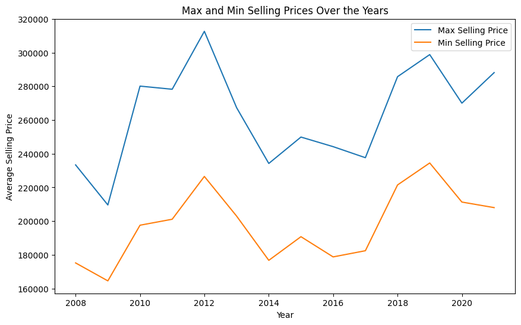
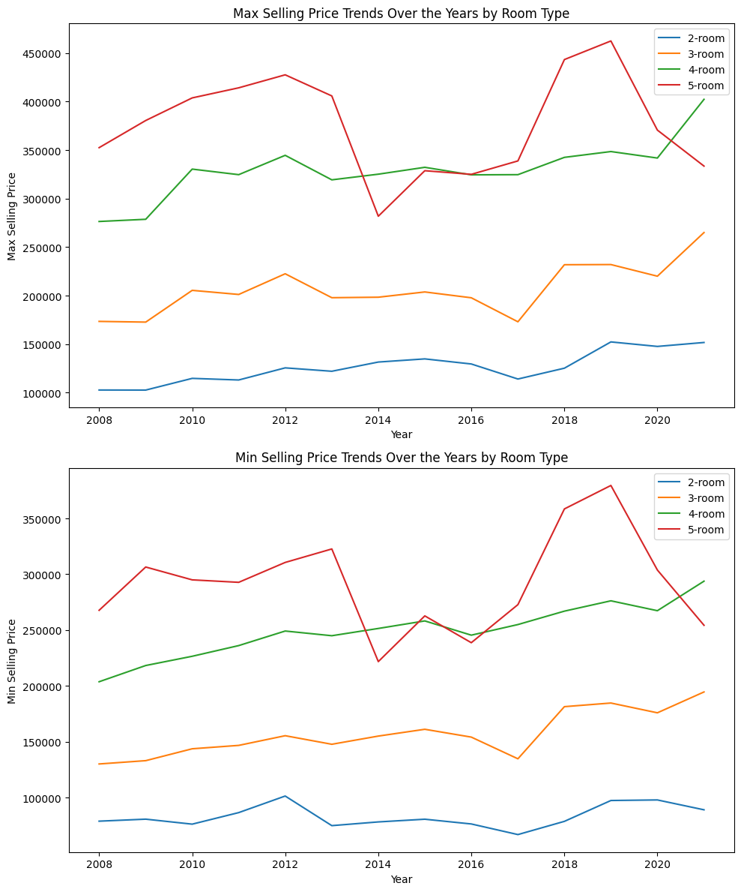
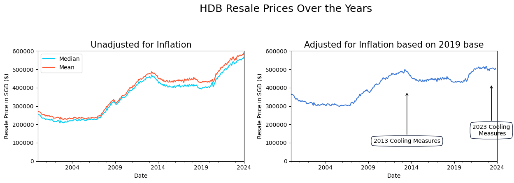
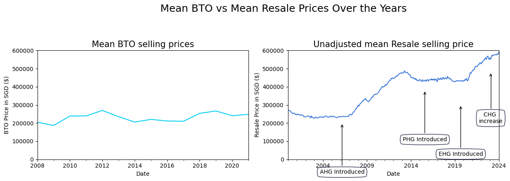
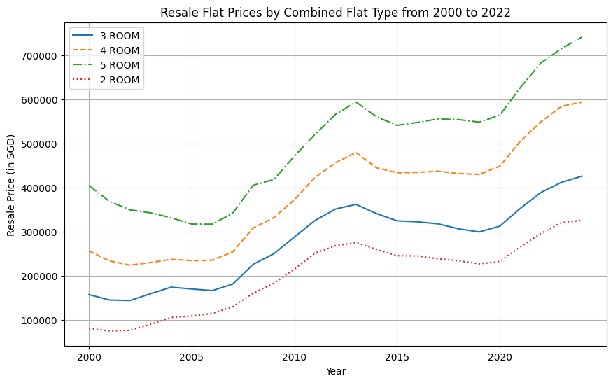
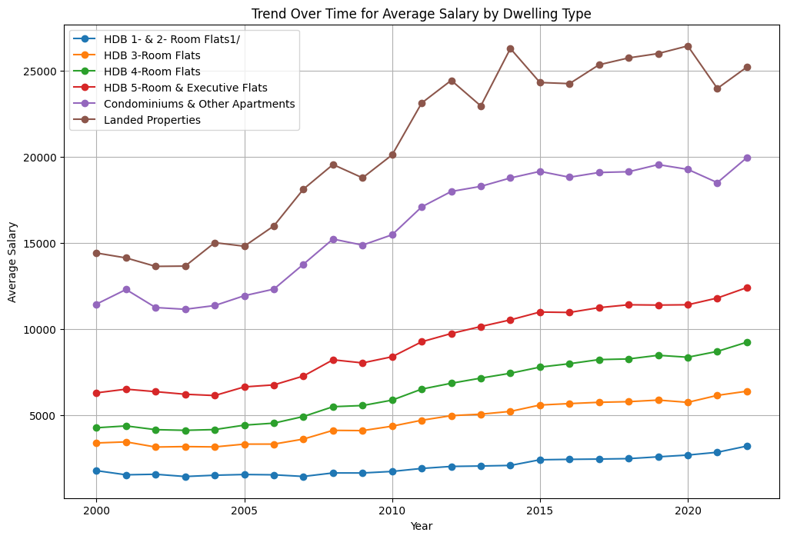
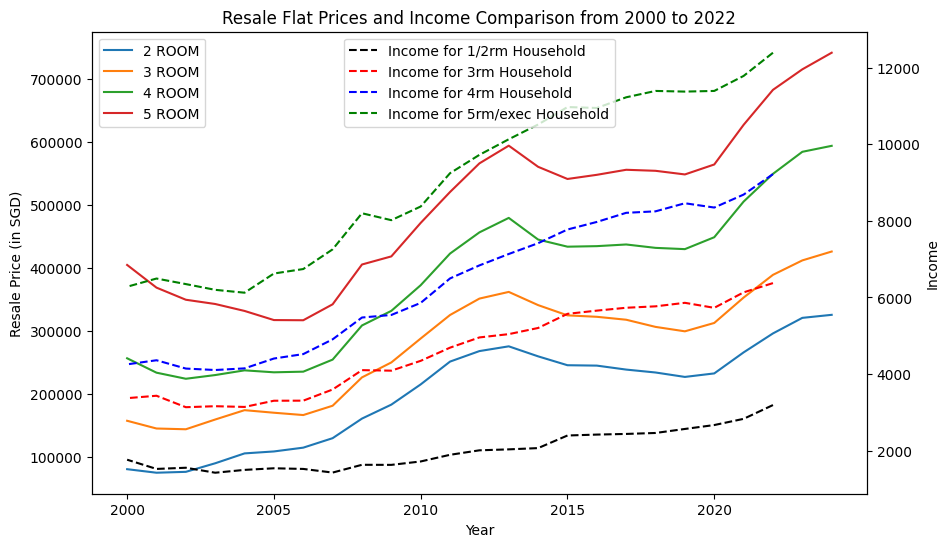
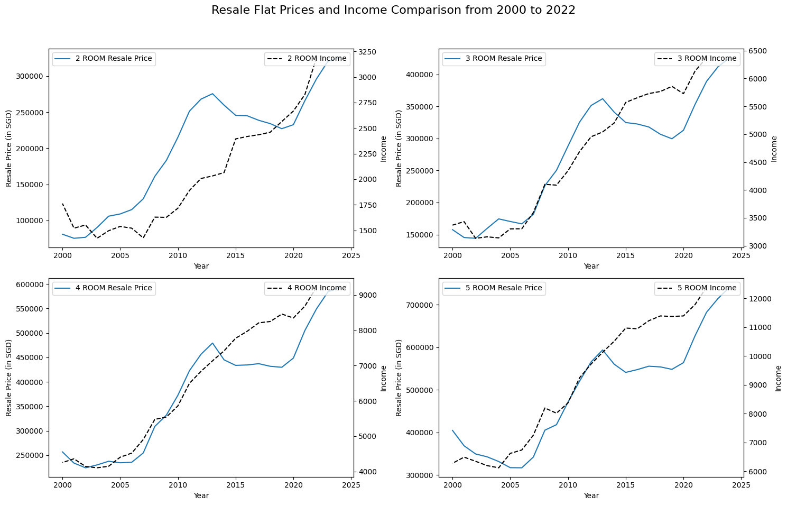
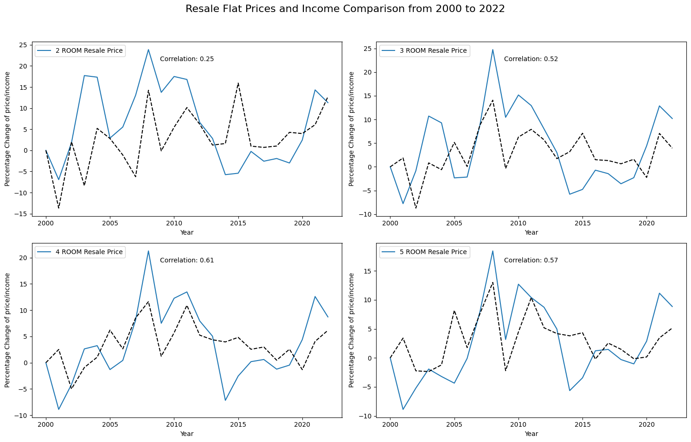

The EDA python note book contains the EDA for the analysis. Some data wrangling was done to ensure trailing space do not create additional category. There were also normalization or scaling done when comparing income against flat prices.

First we plot out the mix/max selling price of BTO flats over the years

    

We also look at the prices categorised by room types
    

    

Then we looked at resale prices unadjusted and adjusted for CPI (notice the the price for earlier years increased due to the base year being in 2019)
    

    

    

We can see the grant introduction precedes most of the price inceases in HDB resale flats. This could be due to excellent policy foresight or that the market is actually pricing in the grants and raising prices knowing the buyers would be ready to pay more.
 
    

    

<table border="1" class="dataframe">
  <thead>
    <tr style="text-align: right;">
      <th></th>
      <th>Year</th>
      <th>HDB 1- &amp; 2- Room Flats1/</th>
      <th>HDB 3-Room Flats</th>
      <th>HDB 4-Room Flats</th>
      <th>HDB 5-Room &amp; Executive Flats</th>
      <th>Condominiums &amp; Other Apartments</th>
      <th>Landed Properties</th>
    </tr>
  </thead>
  <tbody>
    <tr>
      <th>0</th>
      <td>2022</td>
      <td>3189</td>
      <td>6374</td>
      <td>9220</td>
      <td>12390</td>
      <td>19936</td>
      <td>25193</td>
    </tr>
    <tr>
      <th>1</th>
      <td>2021</td>
      <td>2829</td>
      <td>6132</td>
      <td>8685</td>
      <td>11784</td>
      <td>18483</td>
      <td>23951</td>
    </tr>
    <tr>
      <th>2</th>
      <td>2020</td>
      <td>2667</td>
      <td>5728</td>
      <td>8347</td>
      <td>11392</td>
      <td>19254</td>
      <td>26420</td>
    </tr>
    <tr>
      <th>3</th>
      <td>2019</td>
      <td>2565</td>
      <td>5859</td>
      <td>8459</td>
      <td>11375</td>
      <td>19529</td>
      <td>25978</td>
    </tr>
    <tr>
      <th>4</th>
      <td>2018</td>
      <td>2460</td>
      <td>5767</td>
      <td>8248</td>
      <td>11392</td>
      <td>19116</td>
      <td>25724</td>
    </tr>
  </tbody>
</table>

    

    

    

    

    

    

    

    

Percentage change is used to ensure that both price and income are scaled or normalized for a proper comparison and that the correlation can be calculated. We see that there is a certain correlation between income and resale price which could mean that the increase in income could have been a contributing factor to the rising price. However the rise in resale flat price has a higher magnitude which shows that the increase is higher as compared to the salary increase. This is where grants can come into the picture and make up the difference. 
