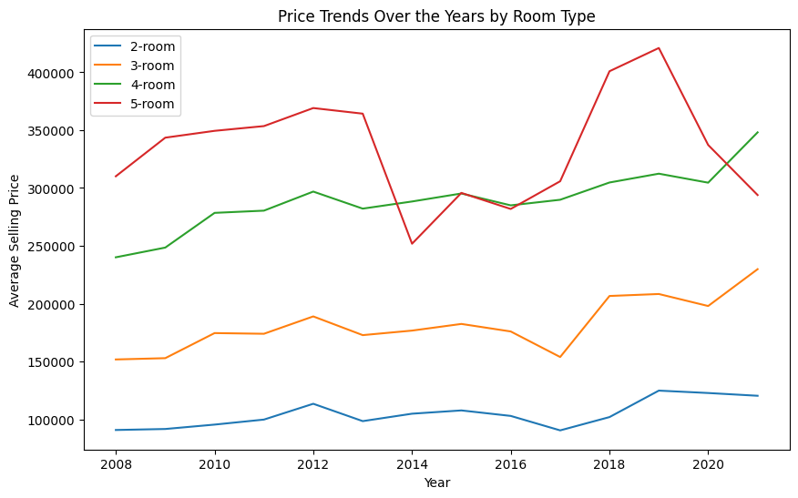
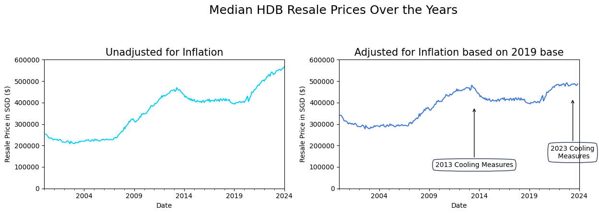

The EDA python note book contains the EDA for the analysis. Some data wrangling was done to ensure trailing space do not create additional category. There were also normalization or scaling done when comparing income against flat prices.

    

    


    

    


    

    


    


    

    


```python
# Plot Median Resale Prices Over the Years
fig = plt.figure(figsize=(14,4.5))
fig.suptitle('HDB Resale Prices Over the Years', fontsize=18)
ax1 = fig.add_subplot(121)

# Plot median resale price
df_prices.groupby('month')[['resale_price']].median().plot(ax=ax1, color='#00cef6', label='Median')
ax1.set_ylabel('Resale Price in SGD ($)')

# Plot mean resale price
df_prices.groupby('month')[['resale_price']].mean().plot(ax=ax1, color='#ff5733', label='Mean')
ax1.legend(labels=['Median', 'Mean'])

ax1.set_xlabel('Date'), ax1.set_ylim(0, 600000), ax1.set_title('Unadjusted for Inflation', size=15)

# Adjusted
# https://jakevdp.github.io/PythonDataScienceHandbook/04.09-text-and-annotation.html
ax2 = fig.add_subplot(122)
df_prices.groupby('month')[['real_price']].mean().plot(ax=ax2, color='#3c78d8', legend=None)
ax2.set_xlabel('Date'), ax2.set_ylabel('Resale Price in SGD ($)'), ax2.set_ylim(0, 600000), ax2.set_title('Adjusted for Inflation based on 2019 base',size=15)
ax2.annotate('2013 Cooling Measures', xy=('2013-07-01',380000), xycoords='data', 
    bbox=dict(boxstyle="round4,pad=.5", fc="none", ec="#28324a"), xytext=(0,-90), textcoords='offset points', ha='center',
    arrowprops=dict(arrowstyle="->", connectionstyle="angle,angleA=0,angleB=90,rad=20"))
 
ax2.annotate('2023 Cooling\n Measures', xy=('2023-05-01',420000), xycoords='data', 
    bbox=dict(boxstyle="round4,pad=.5", fc="none", ec="#28324a"), xytext=(0,-90), textcoords='offset points', ha='center',
    arrowprops=dict(arrowstyle="->", connectionstyle="angle,angleA=0,angleB=90,rad=20"))  
plt.tight_layout(rect=[0, 0, 0.9, 0.9]) 

plt.show()

```

    C:\Users\LAIW0\AppData\Roaming\Python\Python39\site-packages\matplotlib\patches.py:2867: RuntimeWarning: divide by zero encountered in double_scalars
      f1 = self.rad / d1
    C:\Users\LAIW0\AppData\Roaming\Python\Python39\site-packages\matplotlib\patches.py:2871: RuntimeWarning: invalid value encountered in double_scalars
      vertices.extend([(cx + dx1 * f1, cy + dy1 * f1),
    


    

    


```python
fig = plt.figure(figsize=(14,4.5))
fig.suptitle('Mean BTO vs Mean Resale Prices Over the Years', fontsize=18)
ax1 = fig.add_subplot(121)
# Create a new column 'average_selling_price' as the average of 'min_selling_price' and 'max_selling_price'
df['average_selling_price'] = (df['min_selling_price'] + df['max_selling_price']) / 2

# Calculate the average price for each year
yearly_avg_prices = df.groupby('financial_year')['average_selling_price'].mean().plot(ax=ax1, color='#00cef6', label='Mean BTO selling prices')
ax1.set_xlabel('Date'), ax1.set_ylabel('BTO Price in SGD ($)'), ax1.set_ylim(0, 600000), ax1.set_title('Mean BTO selling prices',size=15)
ax2 = fig.add_subplot(122)
df_prices.groupby('month')[['resale_price']].mean().plot(ax=ax2, color='#3c78d8', legend=None)
ax2.set_xlabel('Date'), ax2.set_ylabel('Resale Price in SGD ($)'), ax2.set_ylim(0, 600000), ax2.set_title('Unadjusted mean Resale selling price',size=15)

ax2.annotate('AHG Introduced', xy=('2006-03-01',200000), xycoords='data', 
    bbox=dict(boxstyle="round4,pad=.5", fc="none", ec="#28324a"), xytext=(0,-90), textcoords='offset points', ha='center',
    arrowprops=dict(arrowstyle="->", connectionstyle="angle,angleA=0,angleB=90,rad=20"))
ax2.annotate('PHG Introduced', xy=('2015-08-01',380000), xycoords='data', 
    bbox=dict(boxstyle="round4,pad=.5", fc="none", ec="#28324a"), xytext=(0,-90), textcoords='offset points', ha='center',
    arrowprops=dict(arrowstyle="->", connectionstyle="angle,angleA=0,angleB=90,rad=20"))
ax2.annotate('EHG Introduced', xy=('2019-09-01',300000), xycoords='data', 
    bbox=dict(boxstyle="round4,pad=.5", fc="none", ec="#28324a"), xytext=(0,-90), textcoords='offset points', ha='center',
    arrowprops=dict(arrowstyle="->", connectionstyle="angle,angleA=0,angleB=90,rad=20"))  
ax2.annotate('CHG \nincrease', xy=('2023-02-01',480000), xycoords='data', 
    bbox=dict(boxstyle="round4,pad=.5", fc="none", ec="#28324a"), xytext=(0,-90), textcoords='offset points', ha='center',
    arrowprops=dict(arrowstyle="->", connectionstyle="angle,angleA=0,angleB=90,rad=20"))  
plt.tight_layout(rect=[0, 0, 0.9, 0.9]) 

plt.show()
```

    C:\Users\LAIW0\AppData\Roaming\Python\Python39\site-packages\matplotlib\patches.py:2867: RuntimeWarning: divide by zero encountered in double_scalars
      f1 = self.rad / d1
    C:\Users\LAIW0\AppData\Roaming\Python\Python39\site-packages\matplotlib\patches.py:2871: RuntimeWarning: invalid value encountered in double_scalars
      vertices.extend([(cx + dx1 * f1, cy + dy1 * f1),
    


    


We can see the grant introduction precedes most of the price inceases in HDB resale flats. This could be due to excellent policy foresight or that the market is actually pricing in the grants and raising prices knowing the buyers would be ready to pay more.

    

    


<div>
<style scoped>
    .dataframe tbody tr th:only-of-type {
        vertical-align: middle;
    }

    .dataframe tbody tr th {
        vertical-align: top;
    }

    .dataframe thead th {
        text-align: right;
    }
</style>
<table border="1" class="dataframe">
  <thead>
    <tr style="text-align: right;">
      <th></th>
      <th>Year</th>
      <th>HDB 1- &amp; 2- Room Flats1/</th>
      <th>HDB 3-Room Flats</th>
      <th>HDB 4-Room Flats</th>
      <th>HDB 5-Room &amp; Executive Flats</th>
      <th>Condominiums &amp; Other Apartments</th>
      <th>Landed Properties</th>
    </tr>
  </thead>
  <tbody>
    <tr>
      <th>0</th>
      <td>2022</td>
      <td>3189</td>
      <td>6374</td>
      <td>9220</td>
      <td>12390</td>
      <td>19936</td>
      <td>25193</td>
    </tr>
    <tr>
      <th>1</th>
      <td>2021</td>
      <td>2829</td>
      <td>6132</td>
      <td>8685</td>
      <td>11784</td>
      <td>18483</td>
      <td>23951</td>
    </tr>
    <tr>
      <th>2</th>
      <td>2020</td>
      <td>2667</td>
      <td>5728</td>
      <td>8347</td>
      <td>11392</td>
      <td>19254</td>
      <td>26420</td>
    </tr>
    <tr>
      <th>3</th>
      <td>2019</td>
      <td>2565</td>
      <td>5859</td>
      <td>8459</td>
      <td>11375</td>
      <td>19529</td>
      <td>25978</td>
    </tr>
    <tr>
      <th>4</th>
      <td>2018</td>
      <td>2460</td>
      <td>5767</td>
      <td>8248</td>
      <td>11392</td>
      <td>19116</td>
      <td>25724</td>
    </tr>
  </tbody>
</table>
</div>


    

    

    

    

    

    


    

    


Percentage change is used to ensure that both price and income are scaled or normalized for a proper comparison and that the correlation can be calculated. We see that there is a certain correlation between income and resale price which could mean that the increase in income could have been a contributing factor to the rising price. However the rise in resale flat price has a higher magnitude which shows that the increase is higher as compared to the salary increase. This is where grants can come into the picture and make up the difference. 
